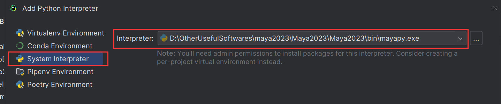
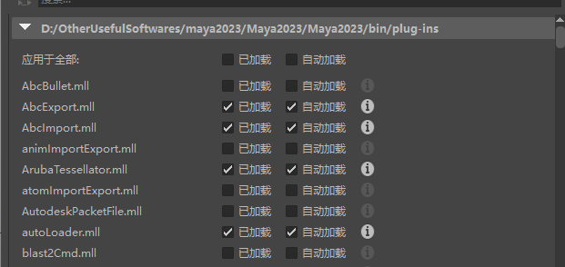

# Maya插件开发教程

参考链接：https://www.cnblogs.com/meteoric_cry/p/15905357.html


# 一、工作流配置

Python开发环境：




# 二、插件解读——部分

## 1.duplicateOverSurface

对应的插件的Github地址：https://github.com/minoue/miMayaPlugins/tree/master/duplicateOverSurface

使用方法：打开Maya->窗口->设置/首选项，然后把对应的Python文件放置在这个窗口中显示的文件夹里（也就是下图当中的plug-ins文件夹里）：



然后勾选已加载和自动加载，此时应该就加载进来了。


### （1）Python源代码解读

#### （a）基本的配置

不多说，应该能看懂：

```python
from maya import OpenMaya
from maya import OpenMayaUI
from maya import OpenMayaMPx
from maya import cmds
try:
    from PySide.QtGui import QApplication
    from PySide import QtCore
except ImportError:
    from PySide2.QtWidgets import QApplication
    from PySide2 import QtCore
import math
import sys

# 第一个插件，照着参考案例抄一份
DRAGGER = "MyDuplicateOverSurfaceDragger"
UTIL = OpenMaya.MScriptUtil()

kPluginCmdName = "MyDuplicateOverSurface"
kRotationFlag = "-r"
kRotationFlagLong = "-rotation"
kDummyFlag = "-d"
kDummyFlagLong = "-dummy"
kInstanceFlag = "-ilf"
kInstanceFlagLong = "-instanceLeaf"
```

下面的这些值会进行配置，这样在执行这个插件的时候就可以把参数传进去（例如本案例都是bool值的参数）。


#### （b）Syntax creator

```python
def syntaxCreator():
    syntax = OpenMaya.MSyntax()
    syntax.addArg(OpenMaya.MSyntax.kString)
    syntax.addFlag(
        kDummyFlag,
        kDummyFlagLong,
        OpenMaya.MSyntax.kBoolean)
    syntax.addFlag(
        kRotationFlag,
        kRotationFlagLong,
        OpenMaya.MSyntax.kBoolean)
    syntax.addFlag(
        kInstanceFlag,
        kInstanceFlagLong,
        OpenMaya.MSyntax.kBoolean)
    return syntax
```

> 您展示的代码片段是一个用于注册命令的语法创建器函数，通常在 Maya C++ 或 Python 插件中使用。它定义了命令的输入参数和选项，这些参数和选项会被 Maya 用来解析用户输入或脚本命令。
>
> 下面是对该函数及其组成部分的详细解释：
>
> ### 1. `OpenMaya.MSyntax()`
>
> `OpenMaya.MSyntax()` 是 Maya API 中的一个类，用于定义命令的语法。这个类允许开发者指定命令所需的参数和标志（flags）。
>
> ### 2. `addArg(OpenMaya.MSyntax.kString)`
>
> 这一行代码添加了一个位置参数，类型为字符串（`kString`）。这意味着当用户调用这个命令时，他们需要提供一个字符串参数。例如，在命令行中可能会看到这样的调用方式：
>
> ```
> myCommand "some string"
> ```
>
> ### 3. `addFlag(...)`
>
> 接下来的几行代码使用 `addFlag` 方法来添加可选标志（flags）。每个标志可以是布尔值，指示某种开关状态。标志的定义如下：
>
> - **kDummyFlag** 和 **kDummyFlagLong**：这是一个标志，用于指示某个“虚拟”或“占位”的功能。在命令中，如果加上此标志，则可以通过布尔值控制相关功能。
> - **kRotationFlag** 和 **kRotationFlagLong**：这是一个与旋转相关的标志，可能用于指示是否应用旋转操作。
> - **kInstanceFlag** 和 **kInstanceFlagLong**：这是一个与实例化相关的标志，指示是否需要创建对象的实例。
>
> ### 返回值
>
> 最后，函数返回构建好的 `syntax` 对象，该对象包含了命令所需的输入参数和标志。这个对象可以在插件的命令实现中使用，以便正确解析用户输入。
>
> ### 小结
>
> 总的来说，`syntaxCreator` 函数的主要作用是定义一个 Maya 命令的输入方式，包括必需的参数（如字符串）和可选的标志（如布尔值），以便在执行命令时能够正确处理用户的输入。这是创建 Maya 命令的标准过程之一，有助于提高用户体验并确保命令的灵活性和可用性。


#### （c）class MyDuplicateOverSurface(OpenMayaMPx.MPxCommand)

首先，是这个类的Init函数：

```python
class MyDuplicateOverSurface(OpenMayaMPx.MPxCommand):
    def __init__(self):
        super(MyDuplicateOverSurface, self).__init__()
        self.SPACE = OpenMaya.MSpace.kWorld

        self.ROTATION = True
        self.InstanceFlag = False

        self.SHIFT = QtCore.Qt.ShiftModifier
        self.CTRL = QtCore.Qt.ControlModifier
        
        self.SOURCE = None
```


##### doIt函数

> 在 Maya 插件开发中，`doIt(self, args)` 通常是命令类中的一个关键方法，用于执行与该命令相关的具体操作。这个方法是在用户调用命令时被自动调用的。下面是一些详细说明，帮助您理解 `doIt` 方法的作用和调用时机。
>
> ### 1. 命令执行流程
>
> 当用户在 Maya 的命令行、脚本编辑器或自定义 UI 中执行某个命令（例如 `myCommand -dummy true "myString"`）时，Maya 会进行以下步骤：
>
> - **解析命令**：Maya 首先会根据注册时提供的语法（由 `syntaxCreator` 函数定义）解析用户输入。
> - **创建命令实例**：如果命令被成功解析，Maya 将创建该命令的实例。
> - **调用 `doIt` 方法**：接下来，Maya 会自动调用该命令实例的 `doIt(self, args)` 方法，将解析后的参数传递给它。
>
> ### 2. `doIt` 方法的角色
>
> `doIt` 方法的主要职责是实现命令的核心功能。通常，这里会包含逻辑来处理输入参数并执行所需的操作。例如：
>
> ```python
> def doIt(self, args):
>     # 解析输入参数
>     string_param = args.asString(0)  # 第一个参数为字符串
>     if args.isFlagSet(kDummyFlag):
>         dummy_flag_value = args.flagArgumentBool(kDummyFlag, 0)
> 
>     # 执行具体操作，例如创建对象、修改场景等
>     print("Executing command with string:", string_param)
>     if dummy_flag_value:
>         print("Dummy flag is set to True")
> ```
>
> ### 3. 方法签名
>
> - **self**：指向命令实例的引用，允许方法访问实例属性和其他方法。
> - **args**：包含解析后的参数和标志，是一个 `OpenMaya.MArgList` 类型的对象，提供了获取各个参数的方法。
>
> ### 4. 调用示例
>
> 假设您的命令名称是 `myCommand`，用户在 Maya 的命令行输入：
>
> ```
> myCommand "example" -dummy true
> ```
>
> 那么，Maya 会：
>
> 1. 解析这个命令和参数。
> 2. 创建 `myCommand` 的实例。
> 3. 调用 `doIt(self, args)` 方法，并将解析后的参数（如字符串 `"example"` 和标志 `-dummy true`）传递给它。
>
> ### 总结
>
> `doIt(self, args)` 方法是 Maya 命令执行过程中非常重要的一环，它是在用户输入命令后自动被调用的，负责实现命令的具体逻辑和功能。通过这种方式，用户的输入可以被有效地转换为实际的操作。

在本示例程序当中，这个doIt函数应当这样写:

```python
def doIt(self, args):
    # Parse the arguments.
    argData = OpenMaya.MArgDatabase(syntaxCreator(), args)
    self.SOURCE = argData.commandArgumentString(0)
    if argData.isFlagSet(kRotationFlag) is True:
        self.ROTATION = argData.flagArgumentBool(kRotationFlag, 0) # 这里的0指的是比如-rotation True，0就是True

    if argData.isFlagSet(kInstanceFlag) is True:
        self.InstanceFlag = argData.flagArgumentBool(kInstanceFlag, 0)

    cmds.setToolTo(self.setupDragger())
```


##### setupDragger函数的说明和代码

```python
def setupDragger(self):
    """ Setup dragger context command """

    try:
        cmds.deleteUI(DRAGGER)
    except:
        pass

    dragger = cmds.draggerContext(
        DRAGGER,
        pressCommand=self.pressEvent,
        dragCommand=self.dragEvent,
        releaseCommand=self.releaseEvent,
        space='screen',
        projection='viewPlane',
        undoMode='step',
        cursor='hand')

    return dragger
```

> 这段代码片段是用于在 Autodesk Maya 中设置一个自定义的拖动工具（dragger context）。以下是对该代码的详细分解和解释：
>
> ### 代码分析
>
> ```
> python复制代码cmds.setToolTo(self.setupDragger())
> ```
>
> - **`cmds.setToolTo(...)`**：这行代码调用 Maya 的命令 `setToolTo`，用于将当前的工具设置为新创建的拖动上下文。
> - **`self.setupDragger()`**：这里调用 `setupDragger` 方法并返回一个新创建的拖动上下文。
>
> ### `setupDragger` 方法
>
> ```python
> def setupDragger(self):
>     """ Setup dragger context command """
> ```
>
> - 这是一个方法定义，目的是设置一个拖动上下文。拖动上下文允许用户通过鼠标拖动来执行特定的操作，比如移动、缩放等。
>
> #### 删除已有的 UI 元素
>
> ```python
> try:
>     cmds.deleteUI(DRAGGER)
> except:
>     pass
> ```
>
> - 这段代码尝试删除名为 `DRAGGER` 的 UI 元素或上下文，以确保不会因为重复创建而导致冲突。
> - 如果没有找到名为 `DRAGGER` 的元素，`deleteUI` 将引发异常，`except` 语句捕获该异常并忽略它。这使得代码更加健壮。
>
> #### 创建新的拖动上下文
>
> ```python
> dragger = cmds.draggerContext(
>     DRAGGER,
>     pressCommand=self.pressEvent,
>     dragCommand=self.dragEvent,
>     releaseCommand=self.releaseEvent,
>     space='screen',
>     projection='viewPlane',
>     undoMode='step',
>     cursor='hand')
> ```
>
> - **`cmds.draggerContext(...)`**：此命令用于创建一个新的拖动上下文，允许定义用户在拖动时的行为。
> - **参数解析**：
>   - **`DRAGGER`**：是拖动上下文的名称，可以是一个字符串常量，通常代表这个上下文的唯一标识符。
>   - **`pressCommand=self.pressEvent`**：当用户按下鼠标时调用的方法，这里指向 `self.pressEvent`。
>   - **`dragCommand=self.dragEvent`**：当用户拖动鼠标时调用的方法，这里指向 `self.dragEvent`。
>   - **`releaseCommand=self.releaseEvent`**：当用户释放鼠标时调用的方法，这里指向 `self.releaseEvent`。
>   - **`space='screen'`**：指定拖动操作是在屏幕空间中进行的。这意味着坐标是相对于整个窗口的，而不是三维场景中的某个对象。
>   - **`projection='viewPlane'`**：表示拖动投影到视图平面上。即操作会沿着视图的平面进行。
>   - **`undoMode='step'`**：设置撤销模式为逐步撤销，允许用户一步步撤销每个操作。
>   - **`cursor='hand'`**：设置鼠标光标为手型，这通常表示拖动操作。
>
> #### 返回拖动上下文
>
> ```python
> return dragger
> ```
>
> - 最后，方法返回创建的拖动上下文对象。这使得上下文可以被 `setToolTo` 使用，从而激活该拖动工具。
>
> ### 总结
>
> 整段代码的目的是创建并设置一个自定义的拖动工具（dragger context），其功能是响应用户的鼠标按下、拖动和释放事件。通过这种方式，开发者能够实现各种交互式功能，例如在 Maya 中移动、缩放或旋转对象等。此代码的一部分还保证了如果已存在同名的拖动上下文，则先删除它，以避免冲突。


##### 鼠标事件的监听回调函数


##### 一个重要的代码片段

> ```python
> self.MATRIX_ORIG = cmds.xform(self.SOURCE, q=True, matrix=True) # 这个就是下一段当中的matrix_orig
> if self.ROTATION is False:  # 如果不需要进行旋转操作
>     NV = OpenMaya.MVector(   # 获取法线
>         matrix_orig[4],
>         matrix_orig[5],
>         matrix_orig[6])
>     NV.normalize()
>     TV = OpenMaya.MVector(  # 获取切线
>         matrix_orig[0],
>         matrix_orig[1],
>         matrix_orig[2])
>     TV.normalize()
> ```
>
> **Q:为什么NV和TV可以获取到法线和切线方向？**
>
> 在给定的代码中，`matrix_orig` 是通过 `cmds.xform(self.SOURCE, q=True, matrix=True)` 获取的变换矩阵。这个变换矩阵是一个 4x4 矩阵，用于描述对象在三维空间中的位置、旋转和缩放。
>
> **注：关于Maya的xform的矩阵，可以参考这个链接：https://willpittman.net:8080/index.php?title=Maya:_xform_matrices，跟我们之前学的那种平移、旋转缩放矩阵是不同的。**
>
> ### 变换矩阵结构
>
> Maya 中的变换矩阵通常具有以下结构（以列主序形式表示）：
>
> ```
> | m00 m10 m20 m30 |
> | m01 m11 m21 m31 |
> | m02 m12 m22 m32 |
> |  0   0   0   1  |
> ```
>
> - **平移**: 由矩阵的第 3 列（m30, m31, m32）表示。
> - **旋转和缩放**: 由前面 3x3 的子矩阵（m00 到 m22）表示。
>
> ### 法线和切线获取
>
> 在上述代码中：
>
> - `NV` 和 `TV` 分别被定义为法线向量和切线向量。
>
> #### 法线向量 (Normal Vector)
>
> ```python
> NV = OpenMaya.MVector(matrix_orig[4], matrix_orig[5], matrix_orig[6])
> ```
>
> - `matrix_orig[4]`, `matrix_orig[5]`, `matrix_orig[6]` 对应于变换矩阵的第二行（m01, m11, m21），这些值实际上代表了局部 Y 轴方向（在 Maya 中，Y 轴通常指上方）。通过将这三个值构建成一个三维向量，然后调用 `normalize()` 方法，可以得到单位法线向量。
>
> #### 切线向量 (Tangent Vector)
>
> ```python
> TV = OpenMaya.MVector(matrix_orig[0], matrix_orig[1], matrix_orig[2])
> ```
>
> - `matrix_orig[0]`, `matrix_orig[1]`, `matrix_orig[2]` 对应于变换矩阵的第一行（m00, m10, m20），这些值代表了局部 X 轴方向。通过构建该向量并进行归一化，可以得到单位切线向量。
>
> ### 总结
>
> - **法线向量** (`NV`) 是从变换矩阵的第二行提取的，表示对象在局部坐标系中的 Y 轴方向。
> - **切线向量** (`TV`) 是从变换矩阵的第一行提取的，表示对象在局部坐标系中的 X 轴方向。
>
> 这样，通过使用变换矩阵的不同行，可以有效地获取到对象的法线和切线方向。在很多图形学应用中，这种方法常用于确定物体的表面朝向和局部坐标系，以便在后续的渲染或物理计算中使用。


### （2）调用该插件的代码解读

**介绍cmds.ls：**

> 在 Maya 的 Python API 中，`cmds.ls` 是一个用于列出当前场景中对象的命令。具体来说，它提供了多种选项来筛选和获取关于场景中的节点（如模型、灯光、摄像机等）的信息。
>
> ### 详细解释
>
> - **`cmds`**：这是 Maya 命令模块的一个别名，通常在脚本的开头使用 `import maya.cmds as cmds` 导入。它包含了 Maya 提供的各种命令和功能。
> - **`ls`**：这个命令是 "list" 的缩写，用于列出场景中的对象。它可以接受多个参数，以根据不同条件返回对象列表。
>
> ### 参数解析
>
> 在您给出的代码中：
>
> ```
> python复制代码cmds.ls(sl=True, long=True)[0]
> ```
>
> - **`sl=True`**：这个参数表示 "select list"，即仅列出当前选定的对象。如果没有选定对象，则返回一个空列表。
> - **`long=True`**：此参数指示返回完整路径（完全限定名称），而不仅仅是简短名称。这对于在复杂场景中区分同名对象非常有用。
> - **`[0]`**：因为 `cmds.ls` 返回的是一个列表，所以 `[0]` 表示获取列表中的第一个元素。这通常是用户当前选定的第一个对象的长名称。
>
> ### 在上下文中的作用
>
> 结合您提到的 `cmds.duplicateOverSurface(...)`，这段代码的整体效果如下：
>
> 1. **获取当前选定的对象**：通过 `cmds.ls(sl=True, long=True)[0]` 获取当前选中的第一个对象的完整名称。
> 2. **执行复制操作**：将该对象作为参数传递给 `cmds.duplicateOverSurface(...)`，并设置 `rotation=True` 以保留其旋转属性。
>
> ### 总结
>
> `cmds.ls` 是一个非常常用的 Maya 命令，用于获取场景中对象的信息。在您提供的代码中，它用于获取当前选定对象的名称，以便随后进行复制操作。这样可以让用户方便地操作和管理 Maya 场景中的对象。


# 三、建模部分

## 1.柱子案例

https://www.youtube.com/watch?v=DFayPxqZMo4
